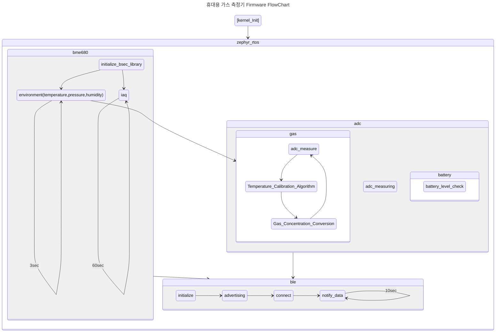

# nordic nrf52832 gas firmware with zephyr rtos

Firmware for Measuring Various Gases (O2, Harmful Gases - Optional 1 select
\[H2S, CO, CI2, NH3, etc...\] , CO2, VOC, IAQ) in an Industrial Environment
and Transmitting Data via Bluetooth Low Energy.

## Flow Chart

## Hardware

- schematic see `doc/*.pdf`

Custom board, Out of Tree

## Electrochemical Gas Sensor

- O2
- Gas(optional select 1 : H2S,CO... Etc)

## Temperature, Humidity, Pressure, IAQ, CO2, VOC Sensor

- bosch bme68x sensor

### Gas classification

#### O2

| Oxygen Concentration Category     | Oxygen Concentration Range | Description                                                                                                                                                 |
| --------------------------------- | -------------------------- | ----------------------------------------------------------------------------------------------------------------------------------------------------------- |
| High Oxygen (High)                | Over 24%                   | Increases the risk of fire and combustion; higher risk of fire and explosion.                                                                               |
| Normal Oxygen (Normal)            | 20.9%                      | Typical composition of air on Earth; no issues in regular environments.                                                                                     |
| Elevated Exposure Risk (Elevated) | 19.5% - 20.9%              | May lead to breathing difficulties, especially at high altitudes or underwater; risk due to oxygen dilution.                                                |
| Low Oxygen (Low)                  | 16% - 19.5%                | Low oxygen environment; may result in breathing difficulties, confusion, and impaired physical functions; prolonged exposure can pose serious health risks. |
| Anoxic (Anoxic)                   | 0% - 16%                   | Oxygen-free environment; survival is impossible, and severe life-threatening conditions develop quickly.                                                    |

#### IAQ

| IAQ Index  | Air Quality         | Impact (long-term exposure)                                              | Suggested action                                                                                                             |
| ---------- | ------------------- | ------------------------------------------------------------------------ | ---------------------------------------------------------------------------------------------------------------------------- |
| 0 - 50     | Excellent           | Pure air; best for well-being                                            | No measures needed                                                                                                           |
| 51 - 100   | Good                | No irritation or impact on well-being                                    | No measures needed                                                                                                           |
| 101 - 150  | Lightly polluted    | Reduction of well-being possible                                         | Ventilation suggested                                                                                                        |
| 151 - 200  | Moderately polluted | More significant irritation possible                                     | Increase ventilation with clean air                                                                                          |
| 201 - 250° | Heavily polluted    | Exposition might lead to effects like headache depending on type of VOCs | optimize ventilation                                                                                                         |
| 251 - 350  | Severely polluted   | More severe health issue possible if harmful VOC present                 | Contamination should be identified if level is reached even w/o presence of people; maximize ventilation & reduce attendance |
| > 351      | Extremely polluted  | Headaches, additional neurotoxic effects possible                        | Contamination needs to be identified; avoid presence in room and maximize ventilation                                        |

#### CO2

|     | Effects                         | PPM  |
| :-: | :------------------------------ | ---- |
| ⚠️  | Dangerous on prolonged exposure | 5000 |
| 😡  | Negative health effects         | 2000 |
| 😩  | Ventilation necessary           | 1200 |
| 🙁  | Ventilation desirable            | 1000 |
| 🙂  | Acceptable level                  | 800  |
| 😀  | Healthy indoor climate          | 600  |
| 😆  | Healthy outside air level       | 350  |

#### VOC

| Level     | Hygienic Rating     | Recommendation | Exposure    | TVOC [ppm]   |
| --------- | ------------------- | -------------------------------------------------------------- | ----------- | ------------ |
| Unhealthy | Unhealthy acceptable | Intense ventilation necessary          | hours       | 2.2-5.5      |
| Poor      | Major objections    | Intensified ventilation / airing search for sources              | \< 1 month   | 0.66-2.2     |
| Moderate  | Some objections     | Intensified ventilation / airing recommendation; search for sources | \< 12 months | 0.22 - 0.66  |
| Good      | No relevant objections         | Ventilation / airing recommended                               | no limit    | 0.065 - 0.22 |
| Excellent | No objections       | Target value                                                   | no limit    | 0-0.065      |

## dependency

[nRF Connect SDK v2.4.2](https://developer.nordicsemi.com/nRF_Connect_SDK/doc/2.4.2/nrf/index.html)
