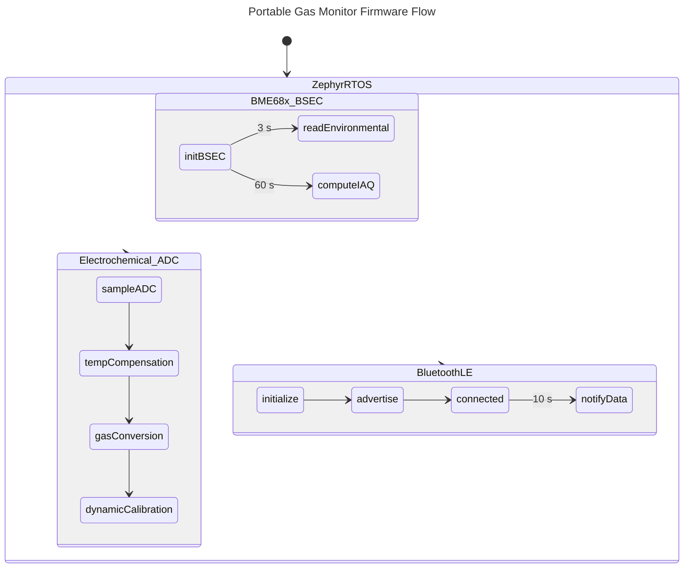

# Industrial Gas Monitor Firmware (nRF52832 + Zephyr)

Firmware version **1.0.2** for HHS's portable industrial gas monitor. The
application runs on a custom nRF52832 board, measures multiple gases, and
transmits real-time readings over Bluetooth® Low Energy. Environmental data is
fused with the Bosch BSEC2 library to provide indoor air-quality indicators in
addition to electrochemical gas concentrations.

---

## Table of contents

1. [Key features](#key-features)
2. [Hardware overview](#hardware-overview)
3. [Supported measurements](#supported-measurements)
4. [Firmware architecture](#firmware-architecture)
5. [Build and flash](#build-and-flash)
6. [Bluetooth protocol](#bluetooth-protocol)
7. [Calibration & persistent settings](#calibration--persistent-settings)
8. [Reference tables](#reference-tables)
9. [License](#license)

---

## Key features

- **Multi-gas sensing** – Electrochemical front-end for oxygen and a selectable
  toxic gas channel (NO₂, CO, H₂S, Cl₂, NH₃, etc.) with temperature
  compensation and dynamic calibration algorithms.【F:src/gas.c†L1-L212】
- **Environmental monitoring** – Integrated BME68x support with Bosch BSEC2
  fusion to derive temperature, humidity, pressure, IAQ, equivalent CO₂, and
  VOC indices. BSEC state is saved to flash for consistent long-term behavior.
  【F:drivers/bme68x_iaq/bme68x_iaq.c†L40-L460】【F:src/settings.c†L1-L137】
- **Bluetooth LE connectivity** – Custom 128-bit GATT service publishes
  semicolon-delimited measurements every 10 seconds and accepts configuration
  commands from a companion application.【F:src/bluetooth.h†L5-L45】【F:src/bluetooth.c†L520-L585】
- **Robust low-power platform** – Built on Zephyr RTOS (nRF Connect SDK v2.4.2)
  with watchdog, power management, persistent storage, and board-specific
  optimizations.【F:prj.conf†L1-L110】

## Hardware overview

- **Target SoC:** Nordic Semiconductor nRF52832 (ARM® Cortex®-M4F, BLE 5).
- **Custom board definition:** `boards/arm/hhs_nrf52832` (schematic and layout
  included in `doc/`).【F:boards/arm/hhs_nrf52832/hhs_nrf52832.yaml†L1-L53】
- **Latest hardware pack:** `doc/gas_nrf52832_rev1.0.1.pdf` with matching
  schematic `doc/gas_nrf52832_sch_rev0.1.0.pdf`.
- **Peripheral highlights:**
  - Bosch BME688/BME680 environmental sensor on I²C.
  - Dual-channel electrochemical sensor front-end via SAADC.
  - Battery gauge through voltage divider + ADC.
  - RGB status LED and watchdog support.

## Supported measurements

| Domain                | Reported values                                              |
| --------------------- | ------------------------------------------------------------ |
| Electrochemical gas   | Oxygen concentration (%VOL) and one selectable toxic gas in
|                       | ppm, both temperature compensated and filtered.【F:src/gas.c†L1-L212】 |
| Environmental         | Temperature (°C), relative humidity (%RH), barometric
|                       | pressure (Pa), IAQ score, equivalent CO₂ (ppm), and breath
|                       | VOC index via BSEC2.【F:drivers/bme68x_iaq/bme68x_iaq.c†L40-L460】 |
| Power                 | Battery percentage derived from loaded voltage profile.
| BLE telemetry         | Timestamped payload streamed every 10 seconds (default).

## Firmware architecture

The firmware is organized into cooperative Zephyr threads and kernel events. A
high-level flow is shown below:



Key modules reside in `src/` (application logic), `drivers/bme68x_iaq/`
(BSEC2 integration), and `lib/` (Bosch libraries). Threads communicate via
Zephyr events for deterministic BLE publishing and alarm handling.

## Build and flash

1. **Install prerequisites**
   - [nRF Connect SDK v2.4.2](https://developer.nordicsemi.com/nRF_Connect_SDK/doc/2.4.2/nrf/index.html)
     with the Zephyr toolchain, `west`, and SEGGER J-Link tools.
   - Bosch BSEC2 library files are already provided under `lib/`.
2. **Fetch the source**
   ```bash
   git clone https://github.com/<your-org>/gas_nordic.git
   cd gas_nordic
   west init -l .
   west update
   ```
3. **Build**
   ```bash
   west build -b hhs_nrf52832 .
   ```
   The output image is generated at `build/zephyr/zephyr.hex`.
4. **Flash**
   ```bash
   west flash
   ```
   or, to use Nordic's command-line tools directly:
   ```bash
   ./flash.sh
   ```
   (`flash.sh` performs a chip erase and programs the generated HEX via
   `nrfjprog`).【F:flash.sh†L1-L5】

## Bluetooth protocol

The device exposes a proprietary 128-bit primary service (`0000FFF0-0000-1000-8000-00805F9B34FB`).【F:src/bluetooth.h†L9-L26】

| Characteristic | UUID                                      | Properties | Description |
| -------------- | ----------------------------------------- | ---------- | ----------- |
| Measurement    | `0000FFF1-0000-1000-8000-00805F9B34FB`    | Notify     | Periodic payload `O2;Gas;Battery;Temp;Pressure;Humidity` separated by semicolons, integers scaled as `<val1>.<val2>` where applicable.【F:src/bluetooth.c†L536-L576】 |
| Command        | `0000FFF2-0000-1000-8000-00805F9B34FB`    | Write      | ASCII commands for calibration and configuration: `O2=<percent>`, `NO2=<ppm>`, `BT=<name>`.【F:src/bluetooth.c†L60-L124】 |

Notifications are issued when a connection is active and the client enables
CCCD. Each update corresponds to the latest sensor snapshot and is throttled to
the configured 10 s publishing interval.

## Calibration & persistent settings

- **Dynamic calibration** continuously refines oxygen and toxic gas baselines by
  monitoring derivative stability, expected ranges, and board temperature.
  Manual calibration can be triggered by writing to the command characteristic as
  described above.【F:src/gas.c†L1-L212】【F:src/bluetooth.c†L60-L124】
- **Persistent storage** uses Zephyr's settings/NVS subsystem to retain BSEC
  state, sensor calibration voltages, and the advertised Bluetooth name across
  reboots.【F:src/settings.c†L1-L200】
- **Battery reporting** samples SAADC channels and converts them into a
  percentage using empirically tuned thresholds (see `src/battery.c`).

## Reference tables

### Oxygen concentration guide

| Category                    | Concentration range | Notes |
| --------------------------- | ------------------- | ----- |
| High oxygen                 | &gt; 24 %             | Elevated combustion risk. |
| Normal air                  | 20.9 %              | Nominal breathable atmosphere. |
| Elevated exposure risk      | 19.5 – 20.9 %       | Monitor for dilution hazards. |
| Low oxygen                  | 16 – 19.5 %         | Impaired cognition and physical performance. |
| Anoxic                      | &lt; 16 %             | Life-threatening within minutes. |

### Indoor air quality (IAQ) interpretation

| IAQ index | Air quality           | Suggested action |
| --------- | --------------------- | ---------------- |
| 0 – 50    | Excellent             | None required. |
| 51 – 100  | Good                  | None required. |
| 101 – 150 | Lightly polluted      | Ventilate if convenient. |
| 151 – 200 | Moderately polluted   | Increase ventilation with clean air. |
| 201 – 250 | Heavily polluted      | Identify contamination source, improve airflow. |
| 251 – 350 | Severely polluted     | Restrict access, maximize ventilation. |
| &gt; 351    | Extremely polluted    | Avoid occupancy until levels normalize. |

### CO₂ comfort levels

| Level | Description                        | ppm |
| :---: | ---------------------------------- | --- |
| 😆    | Healthy outdoor reference          | 350 |
| 😀    | Healthy indoor climate             | 600 |
| 🙂    | Acceptable indoors                 | 800 |
| 🙁    | Ventilation desirable              | 1000 |
| 😩    | Ventilation necessary              | 1200 |
| 😡    | Noticeable health effects          | 2000 |
| ⚠️    | Dangerous for prolonged exposure | 5000 |

### VOC hygiene guidance

| Rating    | Recommendation                                 | Exposure duration | TVOC (ppm) |
| --------- | ---------------------------------------------- | ----------------- | ---------- |
| Excellent | Target value                                    | Unlimited         | 0 – 0.065 |
| Good      | Ventilation recommended                         | Unlimited         | 0.065 – 0.22 |
| Moderate  | Increase ventilation, inspect for sources       | &lt; 12 months       | 0.22 – 0.66 |
| Poor      | Intensify ventilation, locate emission sources  | &lt; 1 month         | 0.66 – 2.2 |
| Unhealthy | Immediate ventilation required                  | Hours             | 2.2 – 5.5 |

## License

Distributed under the terms of the [MIT License](LICENSE). Bosch BSEC2 library
usage is subject to its proprietary license (see `lib/Bosch-BSEC2-Library`).

